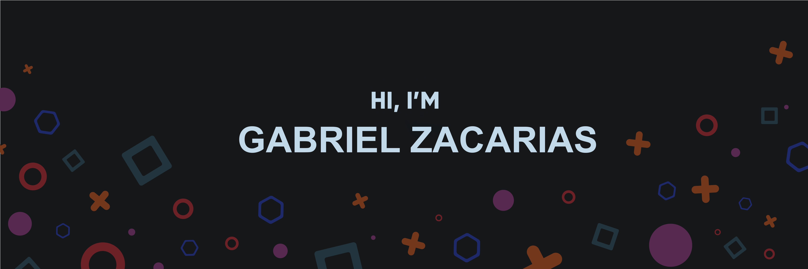

<!--
**GabrielZacarias/GabrielZacarias** is a ✨ _special_ ✨ repository because its `README.md` (this file) appears on your GitHub profile.

Here are some ideas to get you started:

- 🔭 I’m currently working on ...
- 🌱 I’m currently learning ...
- 👯 I’m looking to collaborate on ...
- 🤔 I’m looking for help with ...
- 💬 Ask me about ...
- 📫 How to reach me: ...
- 😄 Pronouns: ...
- ⚡ Fun fact: ...
-->

Hey there 👋

I’m Gabriel, a Software Engineer by day and gamer by night. I specialize in minimal designs, animations, and detail. I thrive in working with others and learning new programming languages, tools, and unit testing!

## 💼 Skills

More Skills

 

